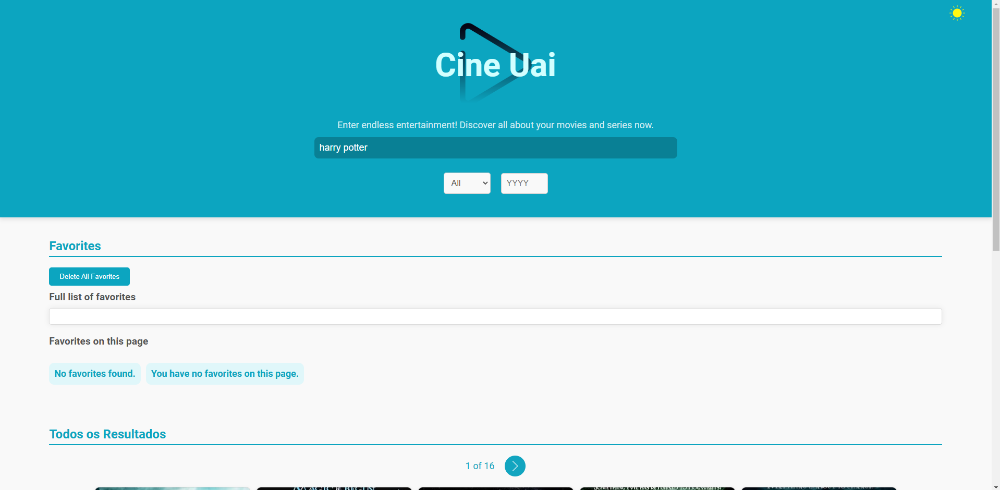
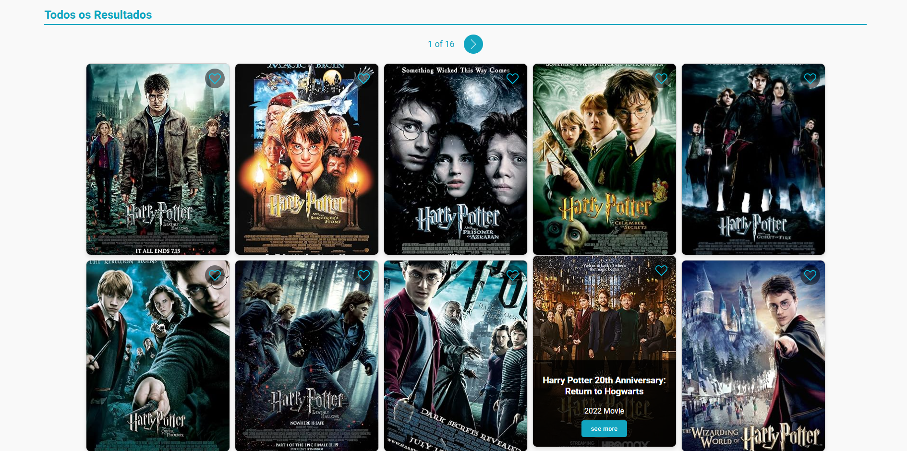
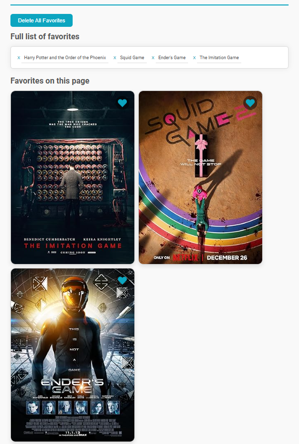

# 🎬 CineUai

O projeto CineUai é uma aplicação web desenvolvida para mostrar informações sobre filmes utilizando a API OMDb. Ele é um projeto proposto com o objetivo de colocar em prática os conhecimentos adquiridos em TypeScript, React, Styled-components e Context API.

## Veja o projeto

Clique [aqui](https://cine-uai.vercel.app/) e veja o projeto funcionando.

## Objetivo 🎯

O objetivo deste projeto é utilizar a [OMDb API](http://www.omdbapi.com/) para obter informações detalhadas sobre filmes, Series e Game. Aqui estão os principais requisitos:

1. **Página Inicial com Listagem de Cards**:

   - Criar uma página inicial que exiba os Cards com pôster, nome, gênero e ano.
   - Incluir um botão que, ao ser clicado, mostre todas as informações complementares.

2. **Alternância de Tema (Light / Dark)**:

   - Adicionar um botão para alternar entre os temas claro (light) e escuro (dark).

3. **Detalhes dos Cards**:

   - Na lista de filmes, cada item deve exibir o pôster e informações básicas do filme.
   - Os elementos da lista devem ser clicáveis.
   - Ao clicar em um filme, devem ser apresentados os seguintes detalhes:
     - Pôster
     - Nome
     - Tipo
     - Ano
     - plot
     - entre outros.

4. **Favoritar Cards**:

   - Permitir que os usuários favoritem os Cards.
   - Exibir uma lista de Cards favoritos.
   - Salvar os Cards favoritos, tema e última pesquisa no LocalStorage para que não sejam perdidos ao sair da guia.
   - Permitir deletar os favoritos individualmente ou todos de uma vez.

5. **Pesquisa e Filtros**:
   - Adicionar um mecanismo de pesquisa para encontrar filmes, Series e Game.
   - Permitir filtrar por tipo e ano.

## Como usar 🛠️

1. **Clone o Repositório**:

   - Abra o terminal ou prompt de comando.
   - Execute o seguinte comando para clonar o repositório para a sua máquina local:
     ```bash
     git clone https://github.com/mariana549/CineUai.git
     ```
   - Isso criará uma cópia do projeto em sua máquina.

2. **Instale as Dependências**:

   - Navegue até o diretório do projeto usando o comando `cd CineUai`.
   - Execute o seguinte comando para instalar as dependências necessárias:
     ```bash
     npm install ou yarn
     ```
   - Isso instalará todas as bibliotecas e pacotes necessários para o projeto.

3. **Configurar a API Key**:

   - Crie uma conta em [OMDb API](http://www.omdbapi.com/) para obter a sua chave de API.
   - Crie um arquivo `.env` na raiz do projeto e adicione a seguinte linha com a sua chave de API:
     ```bash
     VITE_CHAVEAPI = sua_chave_api_aqui
     ```

4. **Inicie o Servidor Local**:

   - Execute o seguinte comando para iniciar o servidor local:
     ```bash
     npm start ou yarn dev
     ```
   - O projeto estará disponível em `http://localhost:5173`.

5. **Explore o Projeto**:
   - Abra o navegador e acesse `http://localhost:5173` para ver o projeto funcionando.
   - Explore as diferentes páginas, interaja com os componentes e divirta-se!

## Recursos 📚

Este projeto usa os seguintes recursos:

- **OMDb API**: Essa API é utilizada para obter os dados dos filmes, como pôster, nome, tipo, ano e etc.
- **React.js**: O React é uma biblioteca JavaScript para construção de interfaces de usuário. Ele é utilizado neste projeto para o desenvolvimento da aplicação web.
- **Styled-components**: Essa biblioteca permite estilizar os componentes React de forma mais dinâmica e modular. Com ela, é possível criar estilos diretamente no código JavaScript.
- **React-router-dom**: Essa biblioteca é utilizada para a navegação entre as páginas da aplicação. Ela permite criar rotas e gerenciar a transição entre diferentes telas.
- **Context API**: A Context API é uma funcionalidade do React que permite compartilhar estados e dados entre diferentes componentes sem a necessidade de passar props manualmente. Neste projeto, ela é usada para criar o Theme Toggler, que permite alternar entre os temas claro e escuro.
- **Axios**: O Axios é um cliente HTTP baseado em Promises que facilita a realização de requisições HTTP. Ele é utilizado aqui para pegar os dados da API do OMDb.
- **Jest**: Jest é uma estrutura de teste em JavaScript utilizada para assegurar que a aplicação funciona conforme esperado. 
- **Vite**: Vite é uma ferramenta de construção e empacotamento de projeto que proporciona um ambiente de desenvolvimento rápido e moderno.
- **Responsividade**: O projeto foi desenvolvido com responsividade em mente, ou seja, ele se adapta bem a diferentes tamanhos de tela, como celulares, tablets e desktops.

#### Neste projeto, foram adicionados os seguintes recursos:

1. **Efeito no Cartão do Filme, series e game**:

   - Adicionei uma animação para destacar os cards quando o usuário interagir com ele.
   - e adicionei uma animação para esconder as informações como titulo, tipo etc. E so aparecer quando o usuário interagir com o card.

2. **Pesquisa de Filmes, series e game na Navegação**: Na barra de navegação, adicionei uma parte para pesquisar filmes, series e game. Essa parte some quando o usuário entra no perfil de um card específico.

3. **Filtrar Filmes, series e game por Tipo e Ano**: Também na barra de navegação, incluí uma seção onde o usuário pode selecionar o tipo e o ano desejado. Ao escolher um tipo ou ano, a lista de cards é filtrada de acordo.

4. **Favoritar Filmes, series e game**: Adicionei a funcionalidade de favoritar os cards, permitindo que os usuários marquem seus filmes, series e game favoritos para fácil acesso posteriormente. Esta lista de favoritos é salva no LocalStorage.

5. **Manter Informações no LocalStorage**: O tema, a última pesquisa e a lista de favoritos são armazenados no LocalStorage para que nada seja perdido ao sair da guia.

6. **Excluir Favoritos**: Implementação da possibilidade de excluir favoritos individualmente ou todos de uma vez, permitindo uma gestão mais fácil dos filmes favoritos.

## Imagens 📷

A seguir, você pode ver algumas capturas de tela do projeto em funcionamento:








